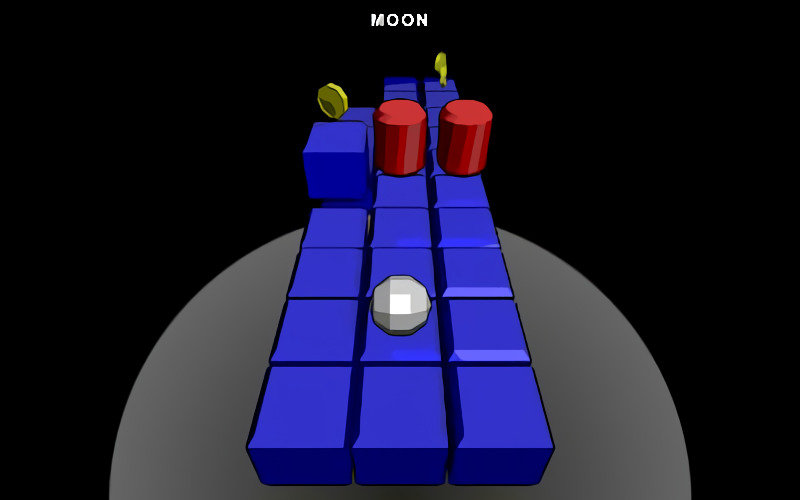

# **Space_Dasher** 

---

 

## **Description 📃**
- "Space, the final frontier" is your ultimate destination in SPACECRAFT. But first, your mission is to collect as many data tokens as possible from the planets and moons of the Solar System. As their gravity accelerates you have to stay on track as well as dodge space junk and asteroids, or zap them with your booster, at least until your probe goes OFFLINE.

## **How to play? 🕹️**
- Controls:
	- Move - W, A, S, D (or) Arrow Keys
	- Jump - Space
	- Pause - P
	
 

## **Screenshots 📸**

 

 
