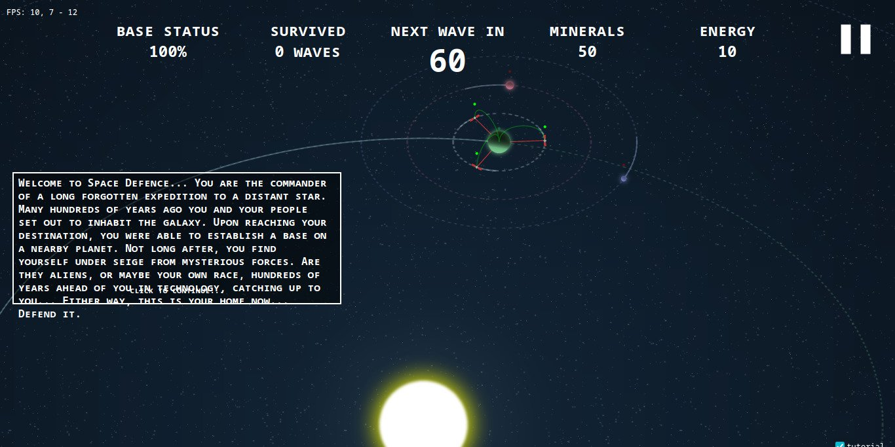

# **Space_Defence** 

---

 

## **Description 📃**
- Explore a vast and mysterious galaxy filled with habitable planets orbiting a distant star.
- Strategically construct satellites and space stations around each planet to defend against waves of enemies.
- Customize your defenses to adapt to each planet's unique challenges, including varying terrains, gravitational anomalies, and atmospheric conditions.
- Upgrade your satellites and stations with powerful weapons, shields, and special abilities to increase their effectiveness in combat.
- Plan your defenses strategically, considering the trajectory and behavior of enemy waves to maximize your chances of survival.
- Utilize resource management skills to balance construction, upgrades, and repairs while staying prepared for incoming attacks.
- Unlock new technologies and abilities as you advance, providing new options for defense and offense.
- Prepare yourself for an interstellar showdown as you build, strategize, and fight to protect humanity's foothold in the cosmos. Will you rise to the challenge and become the savior of the star system, or will the alien forces extinguish the last hope of mankind? The fate of the colonies lies in your hands in Space Defense!

## **How to play? 🕹️**

- Select a Planet: Begin by selecting one of the habitable planets orbiting the distant star. Each planet offers unique challenges and strategic opportunities.

- Construct Defenses: Strategically position satellites and space stations around the planet to establish a robust defense network. Click on the available building options and place them in orbit around the planet.

- Customize Your Defenses: Upgrade your satellites and space stations to enhance their capabilities. Allocate resources to improve weapons, shields, and special abilities. Experiment with different combinations to find the most effective defense strategy.

- Prepare for Battle: Monitor the incoming enemy waves and their trajectory. Plan your defenses accordingly, considering the strengths and weaknesses of different enemy types. Adjust the positioning of your satellites and stations to maximize their coverage and firepower.

- Manage Resources: Collect resources from the planet's surface or through successful defense against enemy waves. Use these resources wisely to build new defenses, upgrade existing ones, or repair damaged structures.

- Complete Objectives: Engage in missions and complete objectives to advance the storyline and unlock additional planets to defend. Explore the mysteries of the alien races and uncover their intentions.

- Victory or Defeat: Successfully defend the planet against waves of enemies to achieve victory. However, if the enemy breaches your defenses and destroys the settlements, you will face defeat. Learn from your failures, adapt your strategy, and aim for ultimate success.

	
 

## **Screenshots 📸**

 

 
