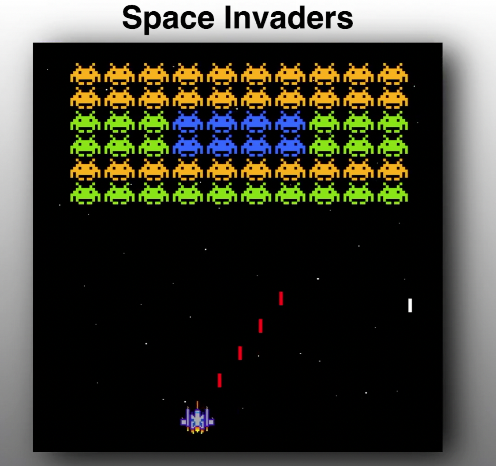

# Space Invaders - Game Dev

YouTube Link: https://youtu.be/qCBiKJbLcFI

In this exciting video we are going to make the classic game space invaders with JavaScript on a HTML canvas. Best of all we will code everything from scratch starting with an empty project.

In this classic game we have our enemies at the top of the screen; they move side to side and down towards our player. At random the enemies will shoot bullets. At the bottom of the screen we have our spaceship which can shoot at the enemies. Unlike the original game our bullets shoot much faster, which also makes the game much more fun. The objective is to stay alive, avoid the enemies bullets and eliminate the enemies before they reach the bottom of the screen.

## We will cover the following topics and more:

- Game loop
- Keyboard input
- Moving our enemies
- Collision detection
- Shooting bullets
- Game audio

If you enjoy this tutorial please subscribe, like and share on YouTube.

Try it here
https://codingwith-adam.github.io/space-invaders/index.html
