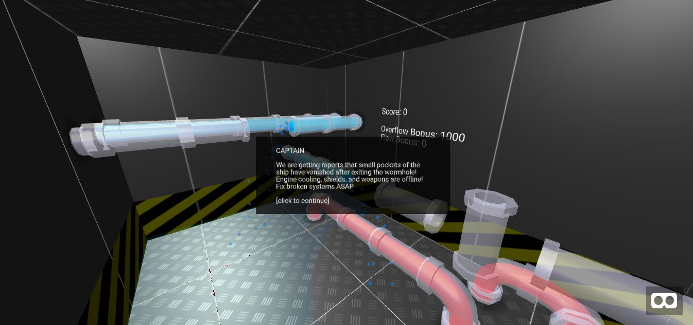

# **Spaceducts** 

---

 

## **Description 📃**
- There's a lot of space out there, between the walls of your ship. 
- Connect broken pipes and wires deep in the belly of your ship. Fix it and get to the next wormhole. 
- But don't drown or get electrocuted along the way! 
- Play through 4 increasingly difficult levels to get your ship back into working order.
- You can play this game on Vive, Oculus, and Desktop.

## **How to play? 🕹️**
- Controls:
    - General: Once a pipe snaps into place, you can pick up or create another. You cannot pick up filled pipes or live wires.

    - Vive/Oculus - Teleport with thumbpad/thumbstick. Grab or create pipes with trigger. Long-press thumbpad/thumbstick to give up if you get stuck.

    - Desktop - `WASD` + `mouse`. Click to pick up or create a pipe. `Q`/`E` and `R`/`F` to rotate a pipe. Click again to place. `L` to give up if you get stuck.
	
 

## **Screenshots 📸**

 

 

## Working Video 📹 

https://github.com/kunjgit/GameZone/assets/92252895/340ec929-5e2a-4786-a361-b5540514230c
