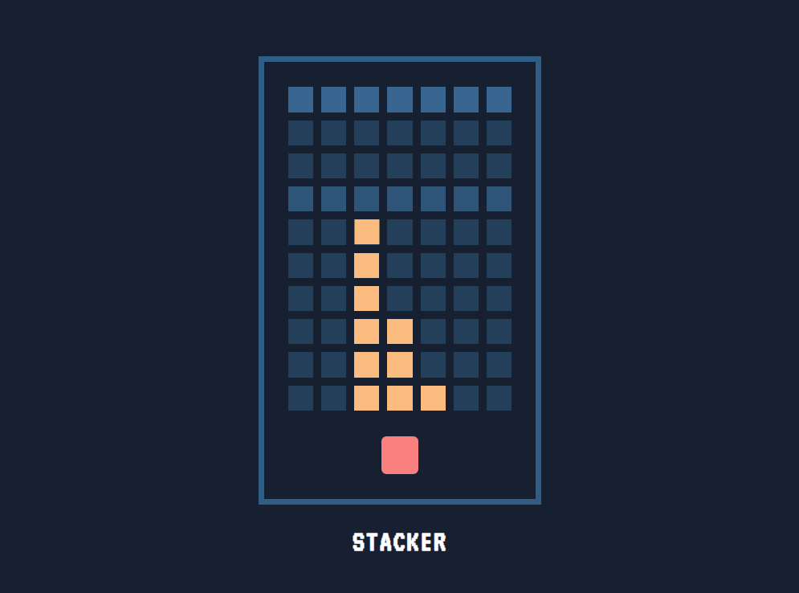

# **Stacker** 

 

## **Description 📃**
<!-- add your game description here  -->
A group fo 3 moving block keeps on moving in the first level, on clicking the button below those group of blocks gets freezed and moves to next lane. At some points group of 3 blocks becomes 2 and on moving to top of the stack the speed of the block increases.The game challanges the player to catch the speed of those moving block to stack over previous blocks

 

## **How to play? 🕹️**
<!-- add the steps how to play games -->
just click the button below whenever you want to stack those group of blocks on to the previous stack. Try to catch the speed of the moving block.

 

## **Screenshots 📸**

 

