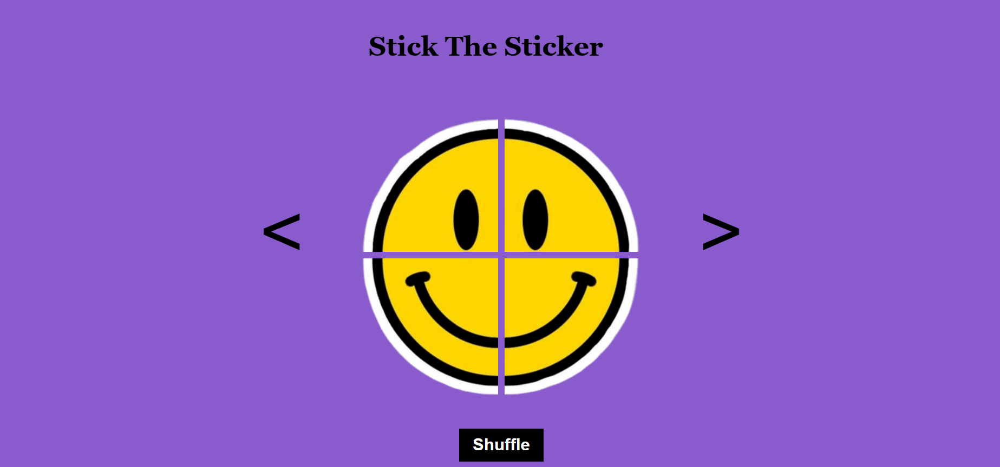
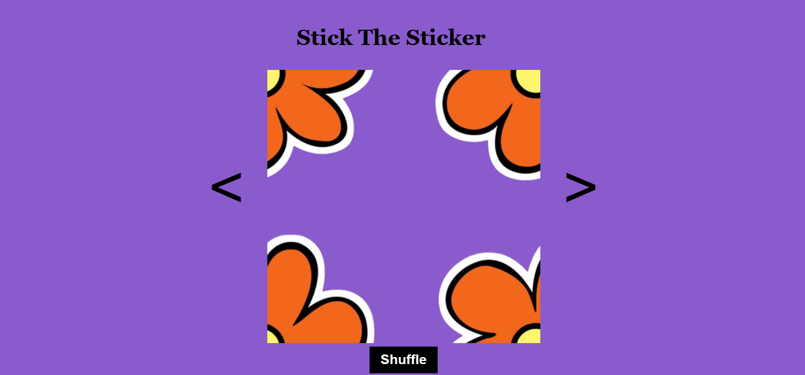

# **Stick the Sticker!** 

---

 

## **Description 📃**

This is a fun game to stick the puzzle pieces of the sticker together. You have to use the shuffle button to shuffle the sticker pieces until it makes an object. While playing you will see many patterns in which the puzzle pieces can be arranged. There are several puzzles to enjoy.

## **Functionalities 🎮**
- The puzzles are in the form of the stickers.
- The shuffle button shuffles the pieces.
- The arrow button open different puzzles.

## **How to play? 🕹️**
- Click on the shuffle button to shuffle the puzzle pieces.
- Stop clicking the button, when the sticker takes a form.
- Use the side arrows to play various puzzles.
 

## **Screenshots 📸**

 
<b>Game Page</b>

 

