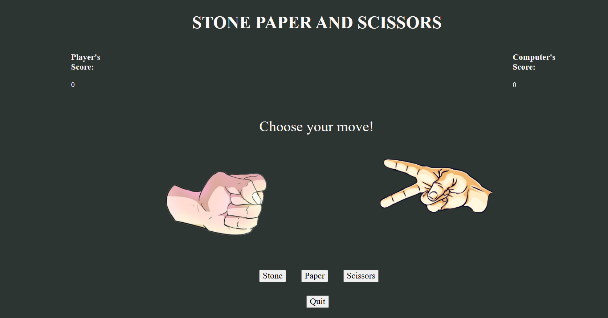

# **Stone_Paper_Scissors** 

---

 

## **Description 📃**

- Stone_Paper_Scissors" is a hand-based game that requires two players at the moment, who choose one out of three available options- 'stone', 'paper', and 'scissors' by making appropriate hand gestures. The two players compete against each other to win by following a set of rules:
1) Player choosing scissors gains a point over the player choosing paper.
2) Player choosing stone gains a point over the player choosing scissors.
3) Player choosing paper gains a point over the player choosing stone.
The player scoring a higher score wins the game.

## **functionalities 🎮**

- The game begins with a page which asks the user to play the game. When the user starts the game, the previous page vanishes and comes to another page with two hand gestures, one belonging to the user and the other to the computer. The page also contains three options ('Stone', 'Paper', 'Scissors') and a quit button.
 
-Depending upon the option chosen by the user, the left-hand changes its gesture. The right hand varies its gesture depending upon the computer's choice, which is generated randomly using random() function. Following the rules(refer to Description), the score is updated after every move.
 
-Quit button functionality leads the user to a result page, which displays whether the user won or lost depending upon the final scores.The game can be restarted by 'Play Again' button.
 

## **How to play? 🕹️**

- Click on the 'Play Now' button to start the game.
 
-Then opens a playground page and asks the user to choose one option out of 'Stone', 'Paper' and 'Scissors'. The hand gestures of the player as well as the computer change, and scores will be updated accordingly.
 
-Click on the 'Quit' button to view the result.
 

## **Screenshots 📸**

 

 

## **Working video 📹**
<!-- add your working video over here -->