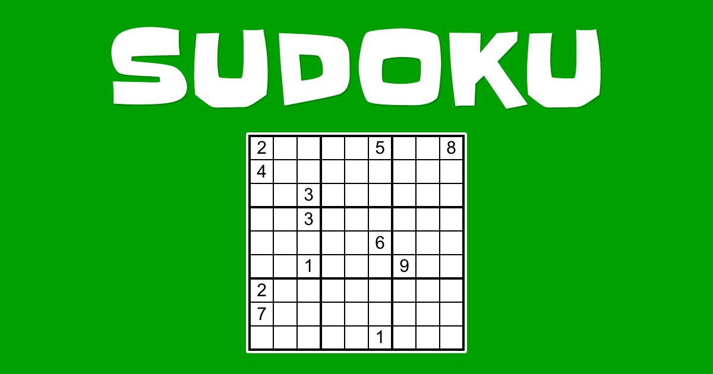
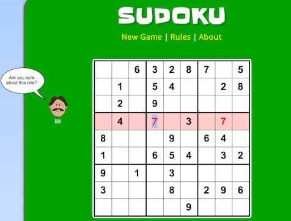

# **Sudoku game**

# **Sudoku**

 

## **Description 📃** 
-Sudoku is a logic-based puzzle. It is a type of constraint satisfaction problem.It is build using html,css,js.

## **functionalities 🎮** 
- Game is build on three levels Easy,medium,hard.
- Which is setup with a suitable time settings.
- And set up with a particular number of lifes displayed with using prompt.
 

## **How to play? 🕹️**
- Most sudoku puzzles come with a few of the boxes already filled in, so you can use those freebie clues as a jumping off point for solving and work backwards.
- The fewer numbers already filled in the more difficult it will be.
- set of conditions stating how the objects must be placed in relation to one another.
- conditions:
  - Each row should have numbers 1-9, no repeats
  - Each column should have numbers 1-9, no repeats
  - Each 3x3 quadrant should have numbers 1-9, no repeats
  
 

## **Screenshots 📸**

 

 

## **Working video 📹**
<!-- add your working video over here -->

## **Description 📃**

<!-- add your game description here  -->

- Sudoku is a popular logic-based puzzle game that challenges your problem-solving skills and critical thinking. The objective of the game is to fill a 9x9 grid with digits so that each column, each row, and each of the nine 3x3 subgrids contains all of the digits from 1 to 9, without any repetition.

## **functionalities 🎮**

<!-- add functionalities over here -->

- Clean and intuitive user interface
- Auto-checking of filled numbers for correctness
- Hint system to provide assistance when needed
- Ability to reset the grid and start a new game
   

## **How to play? 🕹️**

<!-- add the steps how to play games -->

-The game presents you with a 9x9 grid, partially filled with numbers.
-Your goal is to fill in the empty cells with numbers from 1 to 9, following the rules of Sudoku.
-Each row, column, and 3x3 subgrid must contain all numbers from 1 to 9 without any repetition.
-To fill a cell, click or tap on it to select it and then enter the desired number using the on-screen keypad or keyboard.
-The game automatically verifies the correctness of your filled numbers and provides feedback.
-If you get stuck, you can use the hint system to reveal the correct number for a specific cell.
-The pencil marks or notes feature can be used to jot down possible numbers for each cell.
-Continue filling in numbers and using logic to deduce the correct placements until the entire grid is completed.
-Once you successfully fill in all the cells and meet the Sudoku rules, you have solved the puzzle.

 

## **Screenshots 📸**

 

 

