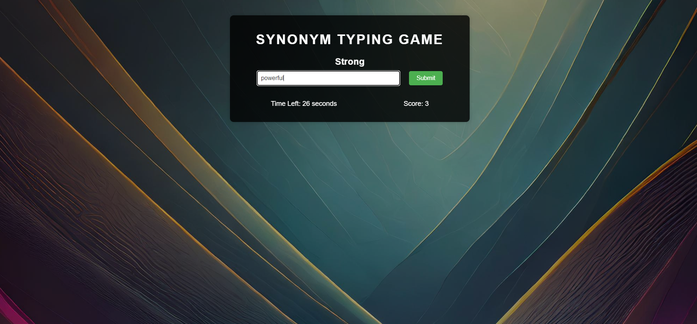

# Synonym Typing Game

## Overview
The Synonym Typing Game is an engaging and educational game where players type synonyms for given words within a time limit. The game is designed with a dark theme and includes a visually appealing interface with animations and responsive design.

## Features
- **Dynamic Word Display**: Random words are displayed, and players must type synonyms.
- **Time Limit**: Players have a limited amount of time to provide synonyms.
- **Score Tracking**: Scores are updated based on correct answers.
- **Responsive Design**: The game adapts to various screen sizes.
- **Dark Theme**: Aesthetic dark theme with a background image.
- **Animations**: Subtle animations for enhanced user experience.

## Demo

