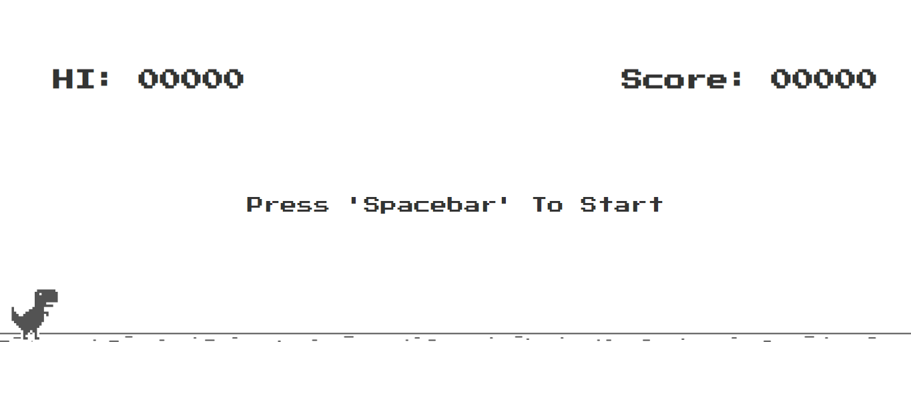
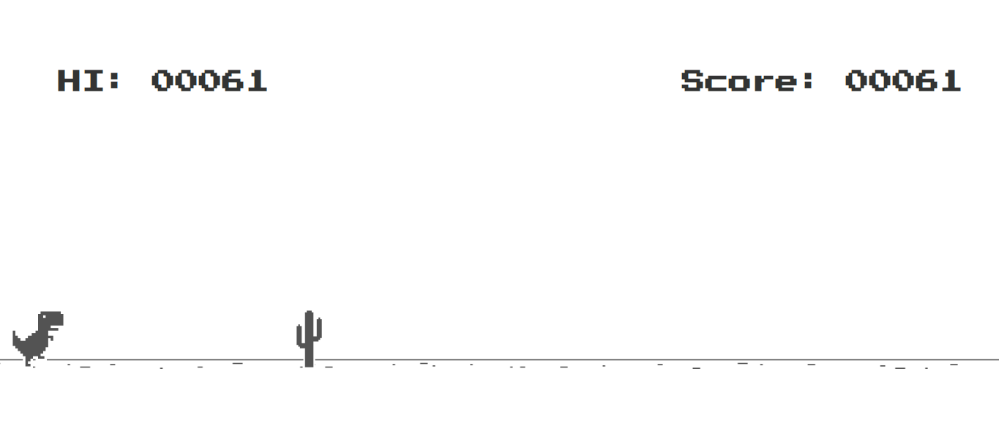
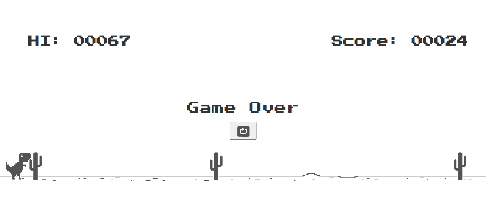

# Game_Name
T-Rex-Run
## Description 📃
T-Rex Run is a simple browser-based game where players control a dinosaur and try to avoid obstacles by jumping over them. The goal is to achieve the highest score possible by surviving for as long as you can.

## Functionalities 🎮
- Control the dinosaur's jump using the Spacebar key.
- Avoid the obstacles by jumping over them.
- Score points for the duration of survival.

## How to Play? 🕹️
1. Open the game in a web browser.
2. Press spacebar to start the game.
3. Control the dinosaur's jump by pressing the Spacebar key.
4. Time your jumps to avoid obstacles and survive for as long as possible.
5. The game ends if the dinosaur collides with an obstacle.
6. Press the Spacebar key to restart or the restart button the game after it ends.

## Screenshots 📸
Include some screenshots showcasing the gameplay and interface of the game.

