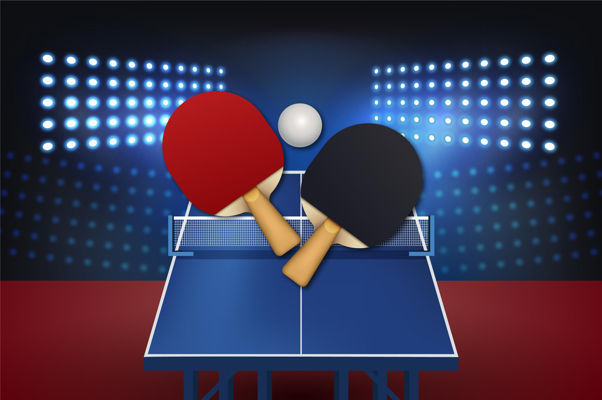

# TABLE TENNIS 

---

 

## **Description 📃**
The game involves two paddles and a moving ball. The players have to move paddles in an upwards or downward direction and save the ball from getting hit by the wall. If the ball hits the wall then it’s a score for another player.
- 

## **functionalities 🎮**
- Keys to control the tetriminos
- Scoreboard
- Simple and engaging user interface containing many tetriminos
- 

## **How to play? 🕹️**
Player 1: Player 1 can control the left side paddle i.e, PADDLE_1 by using the UPARROW key to move upwards and to go downwards DOWNARROW key should be used.
Player 2: Player 2 is the computer or we can call it as AI.
- 

## **Screenshots 📸**

