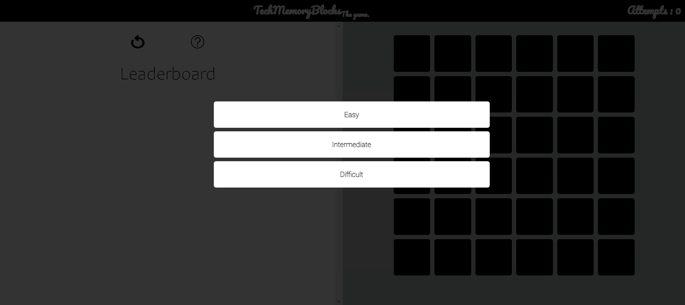
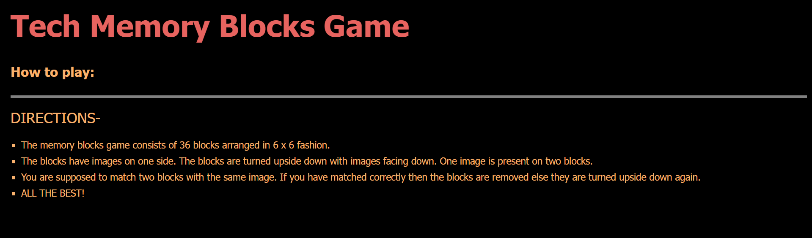

# **Tech Memory Blocks** 

---

 

## **Description 📃**
<!-- add your game description here  -->
- Match pairs of tech icons from various technologies and devices by flipping blocks and remembering their positions to test and improve your memory skills.

## **functionalities 🎮**
<!-- add functionalities over here -->
- Intro Screen — Introduction of the game
- Difficulty mode selection — Selection for a difficulty level for the game. The difference between each level will be explained in a later section.
- Gameplay area — This is where the user plays the actual game.
- Users will have limited number of attempts
- Displays the score of how many icons the user has guessed right
 

## **How to play? 🕹️**
- Open the index.html file
- Select difficulty
- The tech memory blocks game consists of 36 blocks arranged in 6 x 6 fashion.
- The blocks have images on one side. The blocks are turned upside down with images facing down. One image is present on two blocks.
- You are supposed to match two blocks with the same image. If you have matched correctly then the blocks are removed else they are turned upside down again.

 

## **Screenshots 📸**

### Home

### How to play

### Game

