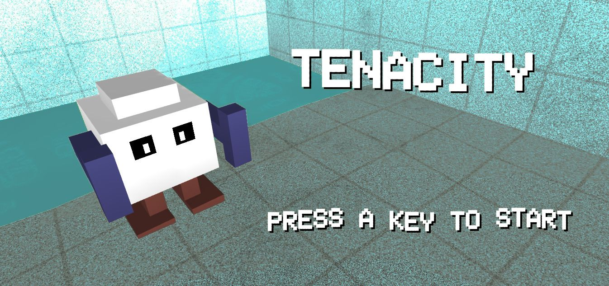

# **Tenacity** 

---

 

## **Description 📃**
- In the 20th century, man set foot on the moon.
- In the 21st century, NASA sent the Curiosity and Perseverance rovers to explore Mars.
- Now we are sending thousands of mini rovers named Tenacity to explore the planets and harvest resources.
- You have been chosen to control one of these robots to an unknown planet. Explore, harvest and leave if you can.

## **How to play? 🕹️**
- Controls :
    - Arrows / WASD / ZQSD
    - `R` for retry a level
    - `M` for mute sound
	
 

## **Screenshots 📸**

 

 

## **Working video 📹**

https://github.com/kunjgit/GameZone/assets/92252895/2ae8e569-97cb-42b7-ae7f-e62aebdc5ed1

