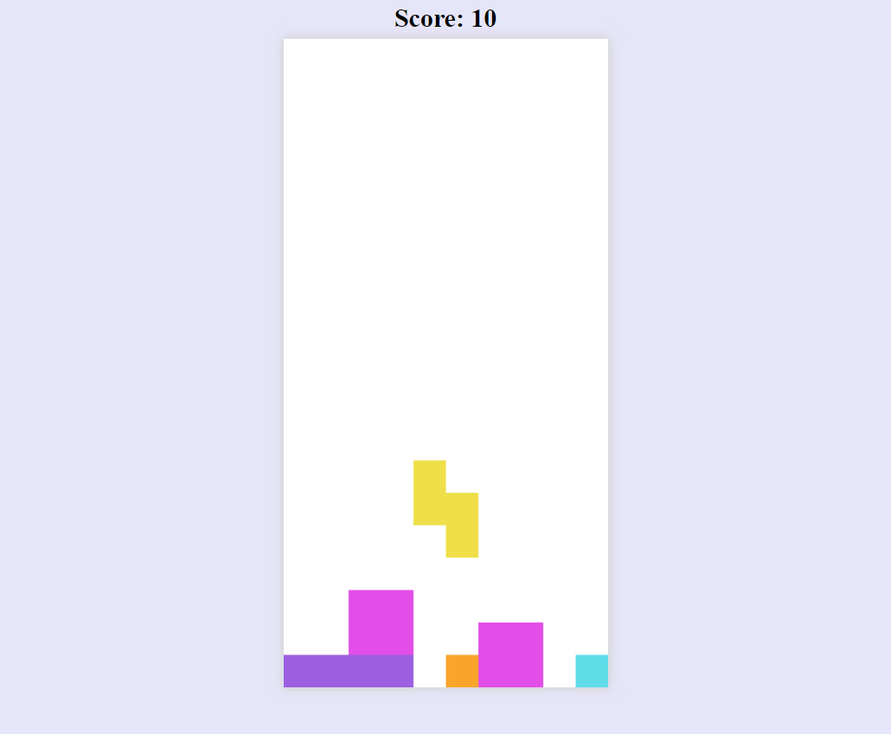

# **Tetris** 

---

 

## **Description 📃**
- this game is developed by html,css and js tech stacks and you can play it easily by using the keys of the device!

## **functionalities 🎮**
- Keys to control the tetriminos
- Scoreboard
- Simple and engaging user interface containing many tetriminos

 

## **How to play? 🕹️**
-As you start the game, the tetriminos will start to cascade down from the top of the grid and collect at the base. To win, you'll need to rotate the Tetriminos so they fit together perfectly and form rows that span the entire playing field. With each clear, the line disappears from the grid, and you gain 10 points. Once the Tetriminos have climbed to the top of the grid, the game is over.

Left Arrow Key/ Left Button - Move Left
Right Arrow Key/ Right Button - Move Right
Up Arrow Key/ Rotate Button - Rotate 90 degrees
Down Arrow Key/Down -Move Down

 

## **Screenshots 📸**

 

 
