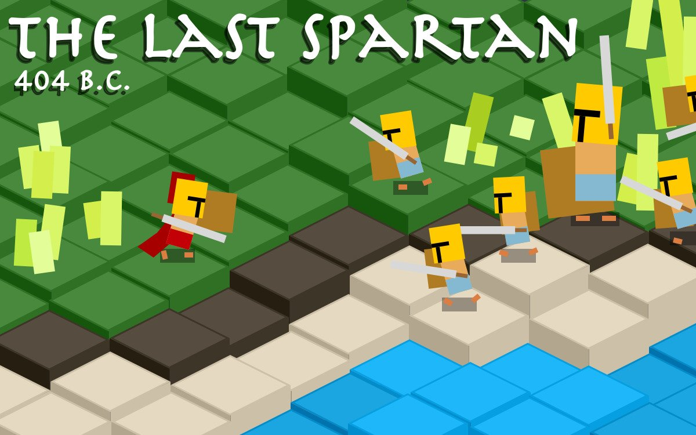

# **The_Last_Spartan** 

---

 

## **Description 📃**
- Cut your enemies to pieces and defend your homeland! Can you, the last Spartan Hoplite of your battalion, earn an honorable death across thousands of procedurally generated battlefields?
- No retreat. No surrender. No way out alive. 
- Kill as many Athenians as you can before you meet the same fate. Then try again.

## **How to play? 🕹️**
- Instructions:
	- Rest from battle to regain your health and stamina. Health and stamina are represented onscreen by the red and blue bars, respectively.
	- Use your spartan charge and ground pound attacks to stun your enemies and gain the upper hand.
- Controls:
	- Move - W, A, S, D
	- Attack - J or Left Mouse Button (LMB)
	- Block - K or Right Mouse Button (RMB)
	- Jump - Space
	- Spartan Charge - K + J / RMB + LMB
	- Ground Pound - Space + J / Space + LMB
	- Pause - P
	
 

## **Screenshots 📸**

 

 
