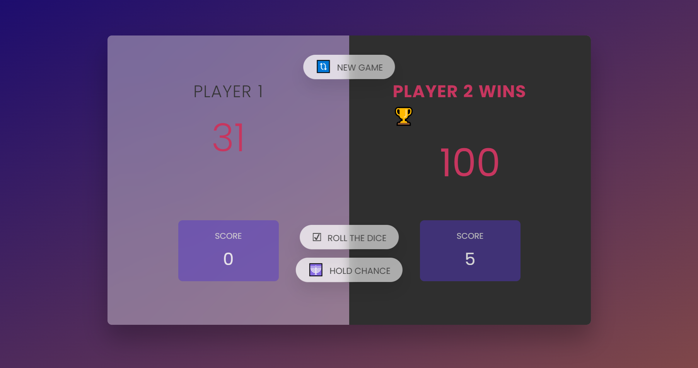

# **The Pig Game** 

---

 

## **Description 📃**
- The Pig game is a classic dice game that people have enjoyed for decades. In this game, players take turns rolling a single die and try to collect points by adding up their rolls. But here's the catch: if a player rolls a 1, they lose all the points they gained in that turn. It's a game that involves both luck and strategy. Players need to decide when to take risks and when to play it safe. 

## **functionalities 🎮**
- Multiplayer: The Pig game can be played with multiple players, taking turns in clockwise or counterclockwise order.
- Players roll the dice and add up their rolls.
- Easy to play 

 

## **How to play? 🕹️**
-  You will have a winning score of 100 points.
-  Start with player 1.
-  Roll the die to determine the player's score for the turn.
- If the player rolls a number other than 1:
   -  Choose to roll again for more points.
   -  Or hold to add the turn score to the total score.
-  If the player rolls a 1:
   - Turn ends, losing all points for that turn.
   - Next player's turn begins.
-  Pass the turn to the next player.
-  Continue taking turns, rolling the die, and accumulating points until a player reaches or exceeds the winning score.
-  The first player to reach or surpass the winning score wins the game.
-   Use a "New Game" button to reset the game to its initial values.

 

## **Screenshots 📸**

 

 

## **Working video 📹**
<!-- add your working video over here -->
