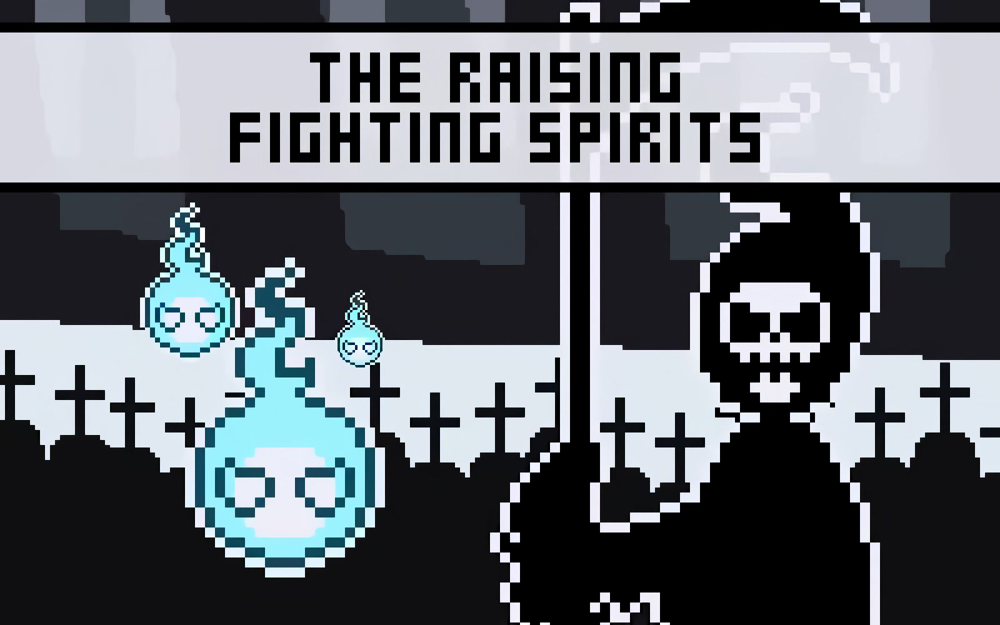

# **The_Raising_Fighting_Spirits** 

---

 

## **Description 📃**
- Is a simple strategy card game where you fight against the Grim Reaper using a horde of spirits!
- Try to kill the Reaper faster to receive a better score!!! BUT watch out for the Reaper's next turn intended action!!!

## **How to play? 🕹️**
- You can stop/start the game sounds in the top right speaker icon.
- Click/touch a soul to select it or use the buttons at the bottom right (next soul/previous soul) to navigate them.
- Look at the Reaper's next turn intention/action to create your strategy.
- Energy lets you know the amount of cards you can play per turn.
- Click and drag cards out/above your hand area to play them.
- End your turn and see the reaper action.
- During game events you can select one of the power up options.

 

## **Screenshots 📸**

 

 
