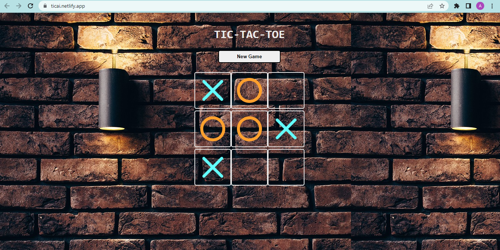

<h1 align="center">Tic Tac Toe with AI</h1>

  Play the classic game of Tic Tac Toe against an AI opponent powered by the Minimax algorithm.

## Features

- Single-player mode against a smart AI opponent
- Responsive design for seamless gameplay on different devices
- Intuitive user interface with a clean and minimalistic design
- Real-time game status display (win, draw, or in-progress)
- Restart option to play again after a game is finished

## Technologies Used

- React: JavaScript library for building user interfaces
- CSS: Styling the game board and user interface
- Minimax Algorithm: AI strategy for determining the optimal moves

## Demo

You can play the game online by visiting the .

## Getting Started

To run the Tic Tac Toe game locally, follow these steps:

1. Clone the repository:

 
   git clone https://github.com/your-username/tic-tac-toe-ai.git

2. Navigate to the project directory:

   cd TicTacToeAI

3. Install the dependencies:

 
   npm install

4. Start the development server:

   npm start

5. Open your browser and visit `http://localhost:3000` to play the game.

## Game Logic and AI Implementation

The game logic is implemented using React components and state management. The Minimax algorithm is used to power the AI opponent. The algorithm calculates the best move for the AI player by recursively simulating all possible moves and selecting the move with the highest score.

## Contributing

Contributions are welcome! If you have any suggestions, bug reports, or feature requests, please open an issue or submit a pull request.

## License

This project is licensed under the [MIT License](LICENSE).
