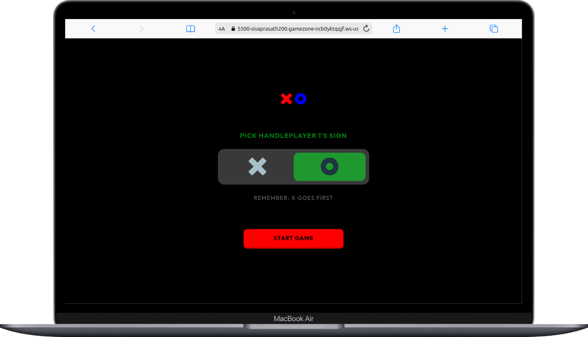
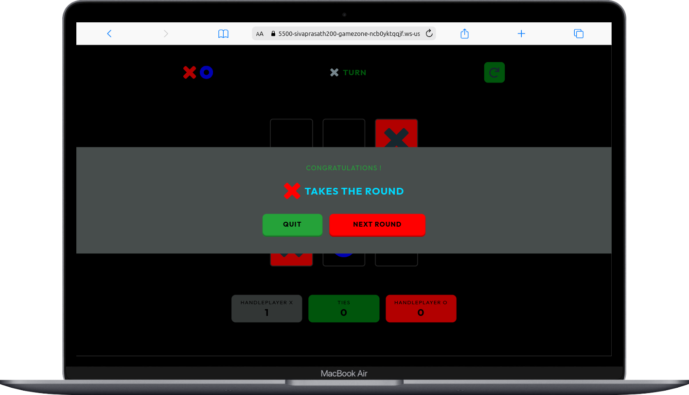

---

# Tic Tac Toe Game

Welcome to Tic Tac Toe Game!, a classic game of Tic Tac Toe brought to life with HTML, CSS, and JavaScript. This simple yet engaging web application allows users to enjoy the timeless game in a modern and interactive way.

## Features:

- **Responsive Design:** Play the game seamlessly on any device, thanks to the responsive design that adapts to various screen sizes.

- **Intuitive Interface:** The user-friendly interface makes it easy for players to understand the game rules and navigate through the application effortlessly.

- **CSS Animations:** Enjoy subtle and appealing animations that enhance the gaming experience, creating a visually pleasing atmosphere.

- **Smart AI Opponent (Coming Soon):** Test your skills against a computer opponent with an intelligent AI. The AI adapts to your moves, providing a challenging single-player experience.

## How to Play:

1. Clone the repository to your local machine.
2. Open the Tic-Tac-Toe in your preferred web browser.
3. Start a new game and take turns with your opponent to place your X or O on the grid.
4. The first player to get three in a row (horizontally, vertically, or diagonally) wins the game.

## Technologies Used:

- **HTML:** The structure of the game.
- **CSS:** Styling and animations for a visually appealing experience.
- **JavaScript:** Logic for gameplay, user interaction, and implementing the Tic Tac Toe rules.

Feel free to report issues, or suggest improvements. Let the Tic Tac Toe battles begin!

### Preview

### Board

