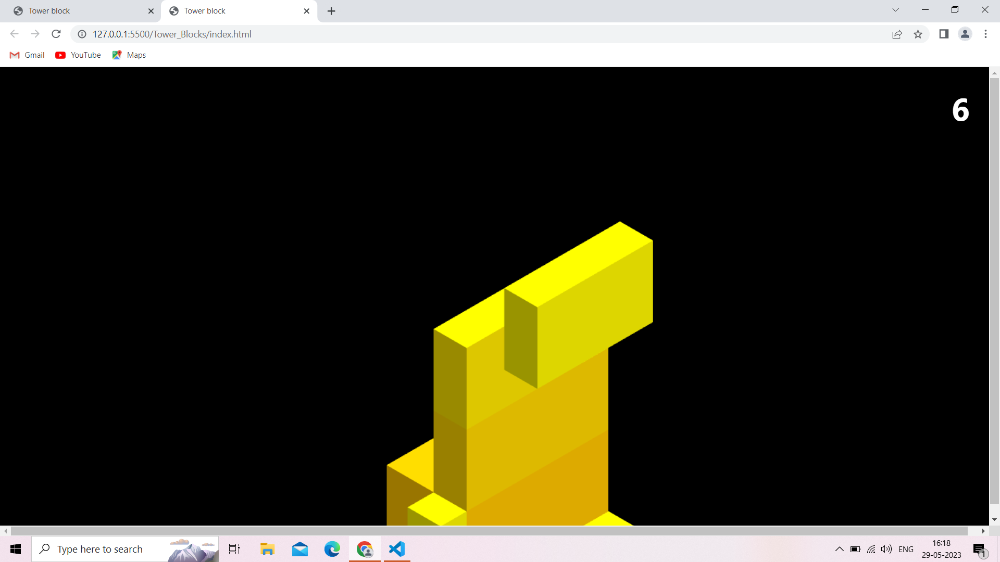

# **TOWER BLOCKS GAME**

---

 

## **Description 📃** 
- Blocks will be sliding in different directions. Your aim is to stop them at the right place so as to make the highest tower possible.

## **functionalities 🎮** 
- Easy to play
- Used Three.js for making the game look 3D. 
 

## **How to play? 🕹️**
1. Start the game either by pressing the Spacebar or by a mouse click.
2. Now either by using Spacebar or mouse or even your finger try to stack the blocks as high as possible with utmost precision.
3. Each time you perform step 2 you get a point. If you fail to do so, no problem! use any three navigating methods to restart the game. 

 

## **Screenshots 📸**

 

 

## **Working video 📹**
<!-- add your working video over here -->

https://github.com/singh-anushka/GameZone/assets/93376863/e17f8b46-349f-498b-86f9-ff7d00345852

