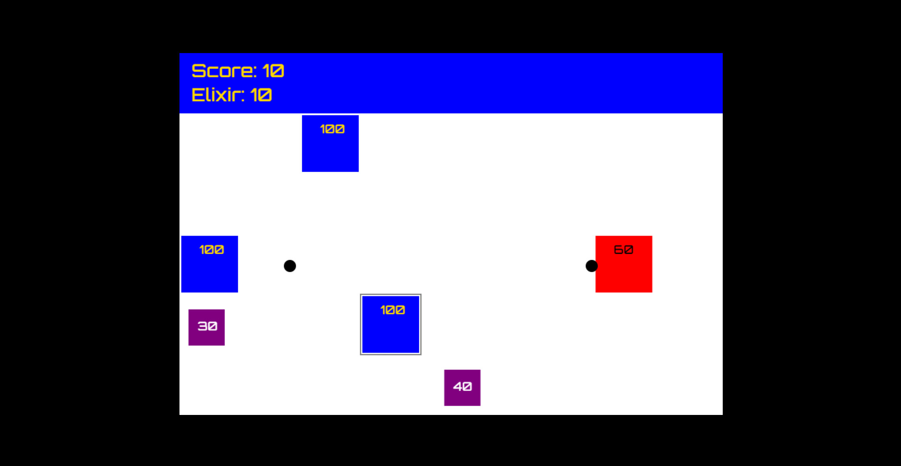

# **Tower_Defense** 

 

## **Description 📃**

A Plants vs Zombies type game where you battle waves of enemies by placing your defensive units and preventing them from reaching your home territory

## **functionalities 🎮**

- Towers: The player can place towers to defend their base from waves of enemies.

- Enemies: Waves of enemies will spawn at the edge of the map and attempt to reach the player's base

- Resources: A player can pick up elixir to spawn defenders quicker.

 

## **How to play? 🕹️**

- Hover on the game grid with your mouse to place defenders

- Inititally you get 300 elixir but placing a defender will consume 100 elixir

- You can re-fill your elixir by either hovering over the elixir points randomly displayed on the game grid or by eliminating an enemy

- Both defenders and enemies have 100 hit points however defenders can shoot projectiles but enemies can only do damage while colliding with a defender 

- Defeating 1 enemy gives you 10 points

- Score 50 points to win!

 

## **Screenshots 📸**

 

 

## **Working video 📹**
<!-- add your working video over here -->
