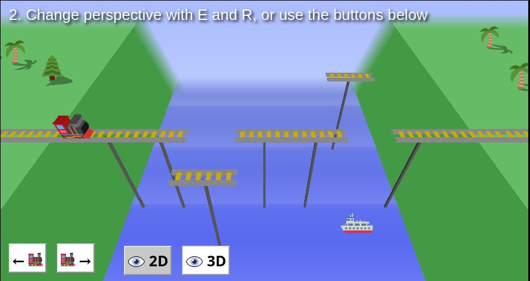

# **Track_Not_Found** 

---

 

## **Description 📃**
- Hey! Where's the track?!
- Play with perspective and optical illusions to help your train cross a river in 11 different levels!
- You can play in fullscreen on desktop by clicking the icon on the title screen (the performance may drop a little).
- You can skip any level with the Escape key.
## **How to play? 🕹️**
- `X` & `C` for moving Train
- There are more to know about controls, you can follow up the instructions during gameplay
- You can try to collect these three trophies:
	- Bonk on the mountain
	- Save the bridge
	- Complete the game
	
 

## **Screenshots 📸**

 

 

## **Working video 📹**

https://github.com/kunjgit/GameZone/assets/92252895/487c107c-72a9-4b5f-a679-3cadb6016001
