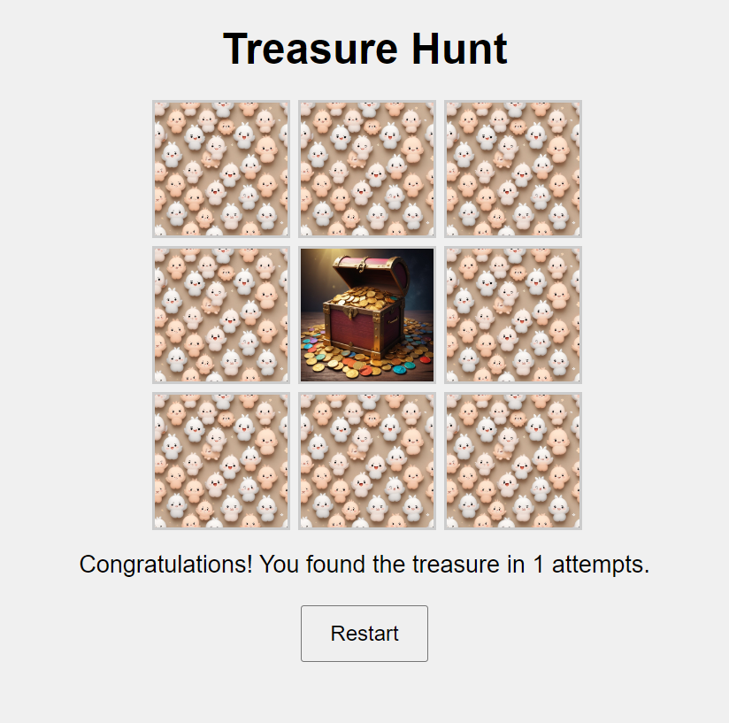

# Treasure Hunt

Treasure Hunt is a simple and fun game where players navigate through a grid to find hidden treasures. Use your intuition and a bit of luck to uncover the treasure in the least number of attempts!

## How to Play

1. **Objective**: Find the hidden treasure on the grid.
2. **Gameplay**:
    - Click on any cell in the 3x3 grid to search for the treasure.
    - If the cell contains the treasure, you'll see the treasure image.
    - If the cell does not contain the treasure, you'll see a wrong guess image.
    - The game will display the number of attempts you have made.
3. **Restart**:
    - Click the "Restart" button to start a new game.

## Features

- **Visual Feedback**: Different images for treasure and wrong guesses.
- **Attempts Counter**: Keep track of the number of attempts made to find the treasure.
- **Restart Functionality**: Easily restart the game to play again.

## Screenshots

## Try It Out

You can try out the game by opening the `index.html` file in your web browser.

