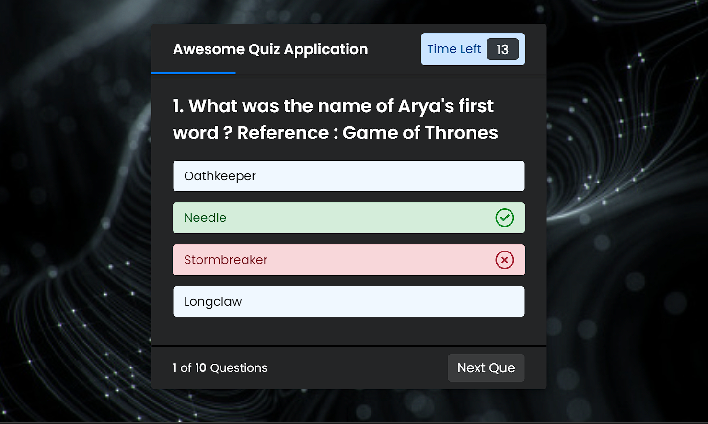

# **Trivia_It!** 

---

 

## **Description 📃**
- Trivita It is a fun quizing game that tests your knowledge on various RomComs and movies through questions. No worries if you get stuck and cannot remember which series/movie is the question referring to. With the hints, we have got you covered ! This version of the game is created using HTML, CSS and JavaScript.  

## **functionalities 🎮**
- The game starts with the click input of the user and takes them to the rules to get them started. 
- There is a timer that counts down 15 seconds.  
- A counter that keeps track of number of correct answers.
- Correct answer is displayed in case of time running out or incorrect answer.
- At the end, total score is displayed along with option to End Game or Restart it.

 

## **How to play? 🕹️**
- Start the trivia by clicking on the button the main screen.
- Read all the instructions carefully. 
- You have to be quick and select the right option before the time runs out. 
- In case you fail to do so, the correct answer will be displayed automatically, however you will gain 0 points for that question.
- For each correct answer, your score increases by 1.
- There is no negative marking in this trivia.
- At the end, you can see your score and can choose to play again or end the game.

 

## **Screenshots 📸**

 

 

## **Working video 📹**
<!-- add your working video over here -->
