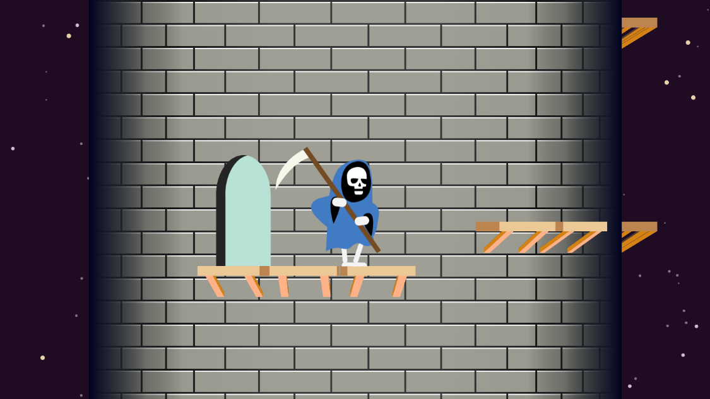

# **Unruly Tower** 

---

 

## **Description 📃**
- An addictive single player vintage game, which was inspired by a bunch of SNES/Mega Drive/Genesis games. 
- Levels similar to this was pretty common in platformers from that era to mix up the gameplay from the usual horizontal scrolling. Good luck! :)

## **functionalities 🎮**
- This game is not about any complex functionalities, but in general just a game focuses on incorporating game logics with JavaScript
- This perfect for any beginner

 

## **How to play? 🕹️**
- `LEFT` and `RIGHT` arrow keys to run, `SPACEBAR` to jump.
- There's no point allotment feature, but the user need to play carefully otherwise the game will be over
- If the skeleton fall or the skeleton standing on the same step for some time then game will be over

 

## **Screenshots 📸**

 