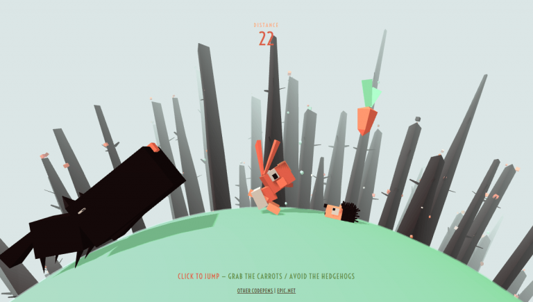

# **Valorous_Rabbit**

---

 

## **Description 📃**

- Valorous Rabbit is an adventurous game created using HTML, CSS, and JavaScript, where players take control of a brave rabbit on a mission to save his life from a dangerous cat.

## **functionalities 🎮**

- The player controls the rabbit clicking on "click to jump". The objective is to navigate the rabbit through various levels or stages, overcoming obstacles and save his life from dangerous cat. The player must avoid colliding with enemies or traps to prevent their life counter from depleting. Collecting power-ups or carrots can enhance the rabbit's abilities or provide extra points. The player's goal is to achieve the highest score and complete the game with the maximum distance covered.
   

## **How to play? 🕹️**

- Press the "Enter key" to start the game.
- The game will randomly and the rabbit is runnig to save his life from the dangerous cat.
- The player has to click on "click to jump" to avoid obstacles ans collect carrots to increase his speed to achive the maximum distance.
- Keep repeating the sequence correctly to advance to higher levels.
- Press the "Play" button again to start a new game.

 

## **Screenshots 📸**

 

 

## **Working video 📹**

<!-- add your working video over here -->

