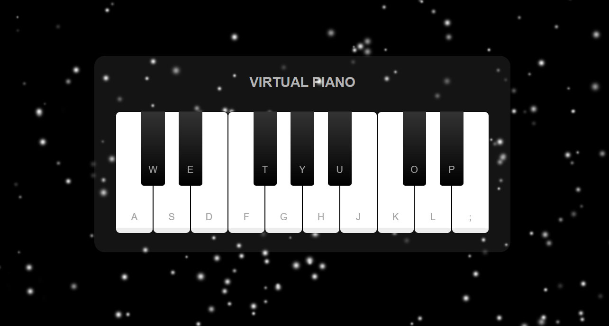

# **Virtual Piano** 

---

 

## **Description 📃** 
- This game is developed using HTML, CSS, and JavaScript tech stacks. You can easily play it by tapping the keys with the mouse or by pressing the keys on the keyboard!

## **functionalities 🎮** 
- High Quality Sound
- Key Press and Mouse Click Events
- Multiple keys at a same time
 
 

## **How to play? 🕹️**

- You just have click on the keys displayed on the piano.
- For a better experience, you can also play the piano by pressing the keys on the keyboard.
 

## **Screenshots 📸**
 

 

## **Working video 📹**
<!-- add your working video over here -->
https://www.mediafire.com/file/qarjq1fn6esf1v5/screen-capture.webm/file