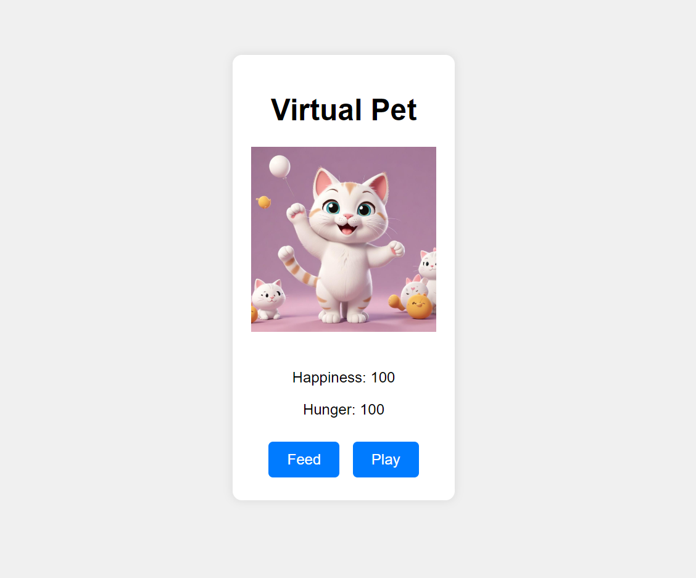

# Virtual Pet

Virtual Pet is a simple and interactive game where players take care of a virtual pet by feeding, playing, and keeping it healthy. It's a fun way to test your virtual pet care skills!

## How to Play

1. **Feed the Pet**: Click the "Feed" button to increase the pet's hunger and happiness.
2. **Play with the Pet**: Click the "Play" button to increase the pet's happiness and decrease its hunger.
3. **Monitor Pet Stats**: Keep an eye on the pet's happiness and hunger levels displayed on the screen.
4. **Maintain Balance**: Ensure the pet's hunger and happiness levels stay above 10 to keep it happy and healthy.

## Game Features

- **Pet Stats**: Displays the pet's current happiness and hunger levels.
- **Interactive Buttons**: Buttons to feed and play with the pet, affecting its stats.
- **Dynamic Images**: Pet image changes based on its happiness level.

## Screenshots

## Try It Out

You can try out the game by opening the `index.html` file in your web browser.
