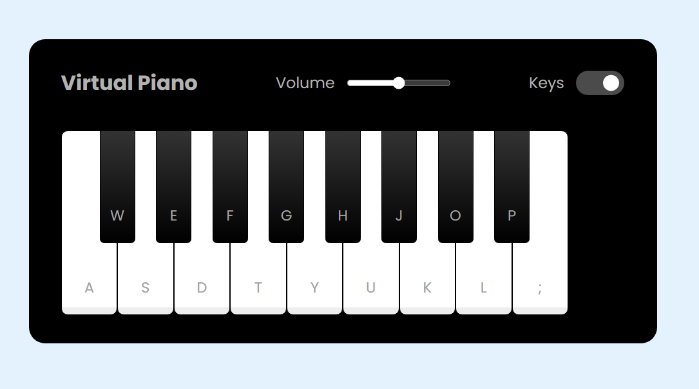
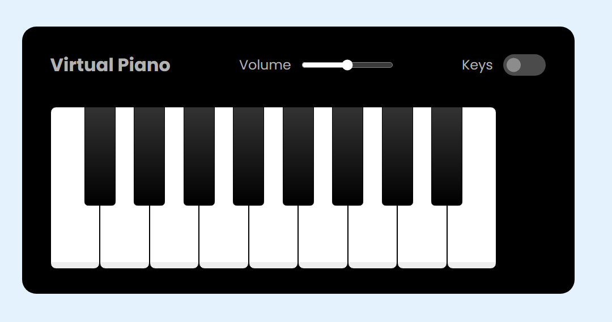

# **Virtual Piano** 

---

 

## **Description 📃**
<!-- add your game description here  -->
An interactive virtual piano game built with HTML, CSS, and JavaScript. The objective of the game is to play musical notes by pressing the keys on the virtual piano, which correspond to real piano keys.

## **functionalities 🎮**
<!-- add functionalities over here -->
- Play Musical Notes: Press the keys on the virtual piano to play corresponding musical notes.
- Keyboard Support: Use the keyboard to play notes for a more intuitive experience.
- Sound Effects: Realistic piano sound effects for each key.

 

## **How to play? 🕹️**
- Open the index.html file
- Start typing the keys to play the sound
- You can adjust the volume and allow visible of keys

 

## **Screenshots 📸**

### Home

### Game

