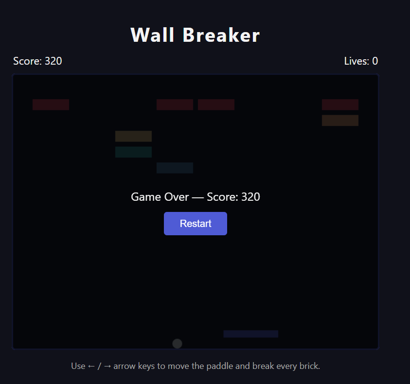

# **Wall Breaker**

---

 

## **Description 📃**
- A classic keyboard-controlled brick-breaking game built with HTML, CSS, and vanilla JavaScript (Canvas API).
- Fixes issue #4635.

## **Functionalities 🎮**
- Paddle controlled entirely by the keyboard (no mouse needed).
- 5 rows x 8 columns of bricks with distinct row colors.
- Score and lives tracking, shown live in the HUD.
- Ball speed/angle changes depending on where it hits the paddle.
- Game Over and You Win overlays, both with a one-click Restart button.

## **How to play? 🕹️**
- Press **Left Arrow** / **Right Arrow** to move the paddle and keep the ball in play.
- Press any arrow key or **Space** on the start screen to begin.
- Break every brick to win. You have 3 lives — miss the ball 3 times and it's game over.

 

## **Scores:**
- +10 points for every brick broken.

## **Screenshots 📸**

 
<!-- add your screenshots like this -->

 
