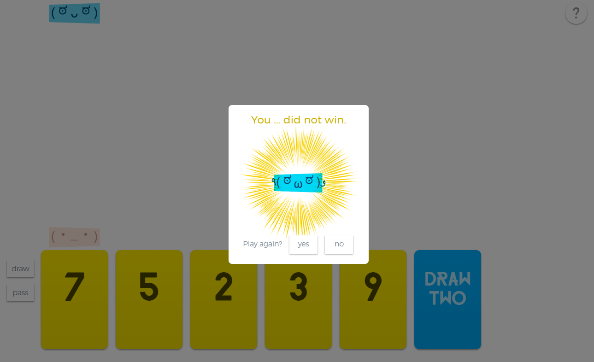

# **Wildcard Bonaza** 

---

 
play your card !!

## **Description 📃**
A classical version of Uno game implemented using html, css and javascript

## **functionalities 🎮**
The game shows some set of cards on the screen for player as well as some for computer the rules of the game is same as Uno game.

 

## **How to play? 🕹️**
Player take turns. On each turn:
The player can either play a card from their hand that matches the color or number of the top card on the discard pile, or they can draw a card from the deck.
If the player plays a card, and it matches the number or color we move forward.
If the player cannot play a card, they must draw a card from the deck.
After the player's turn, it's the computer's turn. The computer will analyze its hand and play a card if there is a match with the top card on the discard pile.
Continue alternating turns between the player and the computer until one of the players has no cards left in their hand.
At the end of the game, the one with no cards will be the winner.
- 
- 

 

## **Screenshots 📸**

 
 

 
