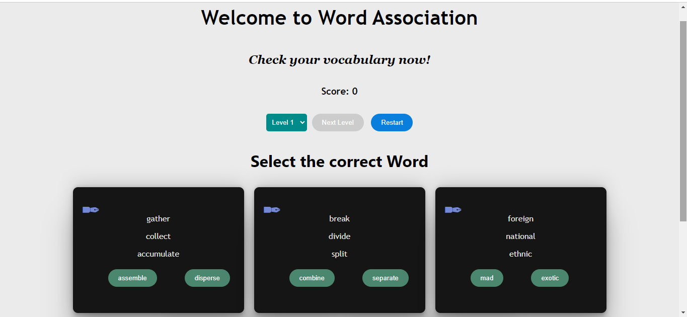
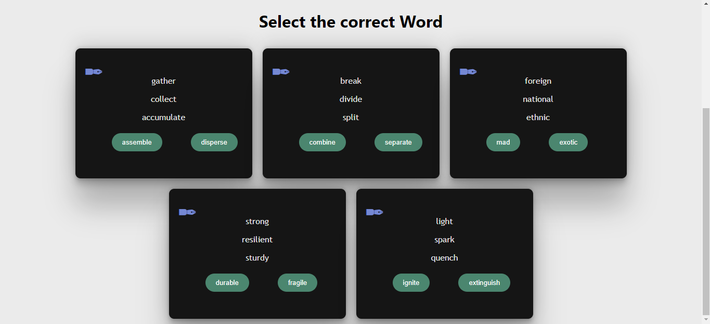
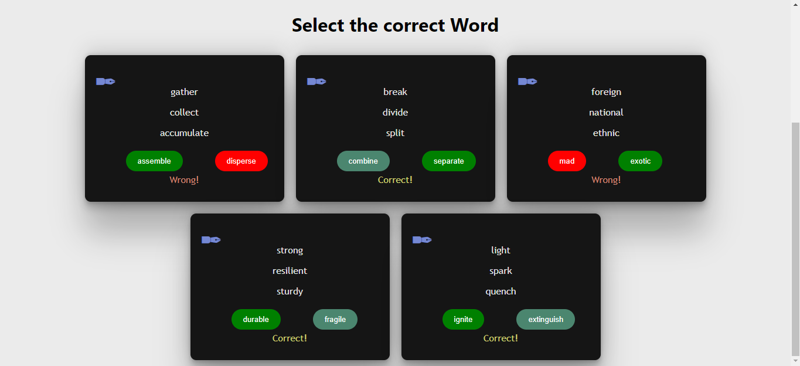
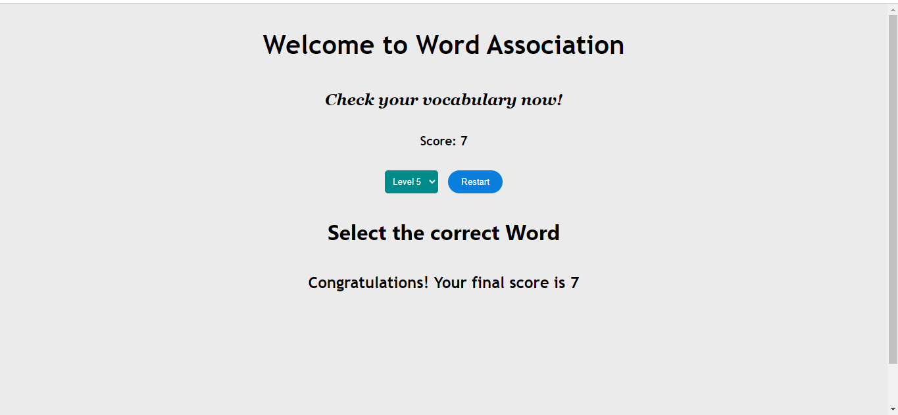

# Game_Name
Word Association Game
## Description 📃
The Word Association Game is a challenging puzzle game where players are presented with a set of words and must find the word that is associated or common with all the given words. Test your vocabulary and association skills in this addictive word game!

## Functionalities 🎮
- Multiple levels with increasing difficulty.
- Each level presents a set of words and two options.
- Choose the word that is associated or common with all the given words.
- Score points for each correct answer.

## How to Play? 🕹️
1. Launch the game on your device.
2. Read the set of words provided for each level.
3. Examine the two options given.
4. Choose the word that is associated or common with all the given words.
5. Submit your answer.
6. Receive feedback on whether your answer is correct or not.
7. Proceed to the next level and repeat the process.
8. Aim for a high score by answering as many questions correctly as possible.

## Screenshots 📸
Include some screenshots showcasing the gameplay and interface of the game.

