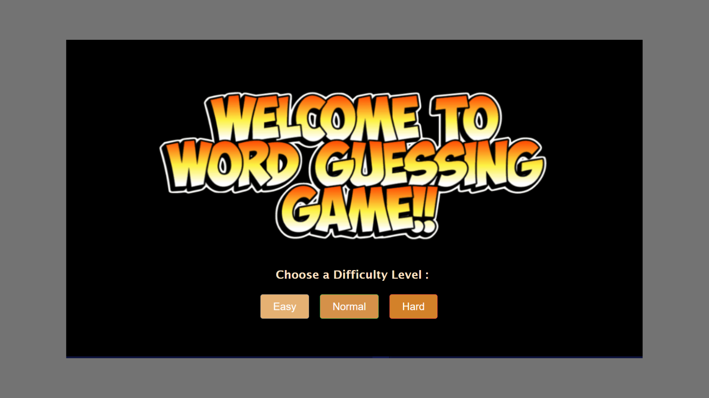
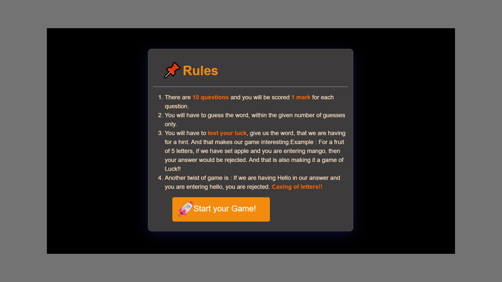
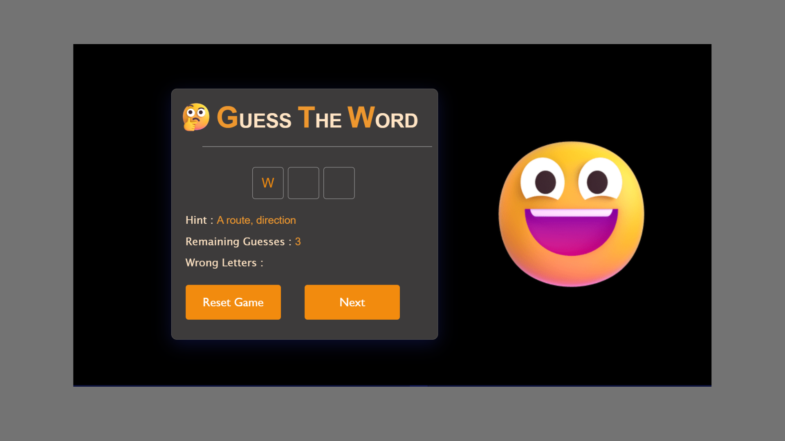

# **Word Guessing Game**

---

## **Description 📃**

- Word Guessing Game is a simple game used to sharpen the English Vocabulary.It is a simple game where the user has to guess the word by filling the blanks. If the user guesses the word within given number of chances, he/she wins the game. If the user fails to guess the word within given number of chances, he/she loses the game.It is built using basic web dev tech stacks like HTML, CSS, and JavaScript.

## **Functionalities 🎮**

Game consists of following functionalities :

<ol>
<li>User will get a chance to select the difficulty level of the game(Easy,Medium or Hard).Based on the level of game, the number of guesses would change.</li>
<li>User has to select within the given number of guesses only.</li>
<li>For every correct answer, user would get 1 mark.</li>
</ol>

## **How to Play? 🕹️**

- You have to select the difficulty level.
- After selecting the difficulty level, you would be getting the number of chances to guess the word.
- At end of the game, you would be getting the score after finishing all the 10 questions accurately.

## **Screenshots 📸**

 
## Landing Page

## Rules

## Game

## Score

<!-- add your screenshots like this -->
<!--  -->

## **Working Video 📹**

 

<!-- add your working video over here -->
