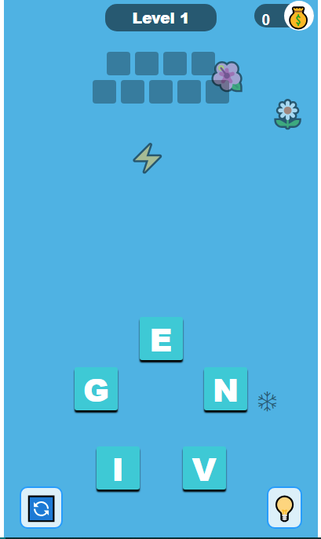

# **Word Shuffle Game**

---

## **Description 📃**

The Word Shuffle game challenges players to unscramble a set of letters to form meaningful words within a given time frame. Players are presented with a grid of letters, and they must rearrange these letters to create valid words. The game provides hints and shuffle options to assist players in finding words. Each level becomes progressively more difficult, with longer words and shorter time limits.

## **Features 🎮**

- **Word Unscrambling:** Players unscramble letters to form valid words.
- **Time Limit:** Each level has a time limit within which players must complete the word unscrambling task.
- **Hints:** Players can use hints to reveal letters or words to aid them in solving the puzzle.
- **Shuffle Option:** Players can shuffle the letters to get a different arrangement, potentially revealing new word combinations.
- **Progressive Difficulty:** As players advance through levels, the complexity of the word puzzles increases.
- **Score Tracking:** The game keeps track of players' scores based on the number of words solved and the time taken.
- **Level System:** Players progress through different levels, each with its own unique set of word puzzles.
- **Responsive Design:** The game is designed to be playable on various devices with different screen sizes.

## **Screenshots 📸**

## **How to Play? 🕹️**

To play Word Shuffle:

1. Unscramble letters to form words.
2. Beat the time limit for each level.
3. Use hints or shuffle for help.
4. Levels get harder as you progress.
5. Track your score.
6. Unlock new levels.
7. Play on any device.

Have fun unscrambling!