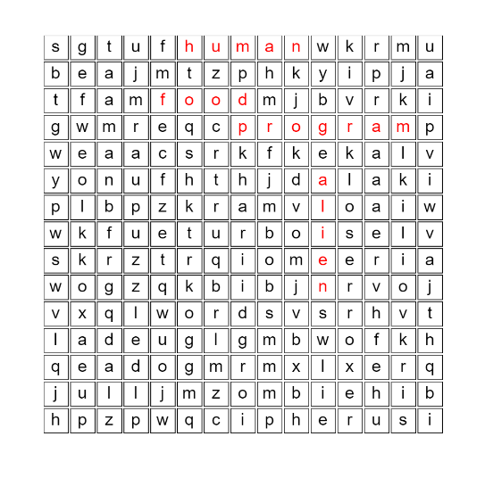

# **Word Search Puzzle** 

---

 

## **Description 📃**
<!-- add your game description here  -->
This is a word search puzzle generator / game made using JS and p5 library with 15 * 15 grid with 15 words in the puzzle with word length <= 7
- 

## **functionalities 🎮**
<!-- add functionalities over here -->
<ol>  
<li>Vertical / Diagonal / Horizontal Word placement</li>
<li>Random puzzle generation</li>
<li>Each time the page is refreshed the letters in the puzzle are jumbled</li>
</ol>
- 
 

## **How to play? 🕹️**
<!-- add the steps how to play games -->
- You have to drag the mouse to select as many as meaningful words found.
- If the word selected is meaningful, it will be highlighted in red.

 

## **Screenshots 📸**

 
<!-- add your screenshots like this --> 
 

 
 