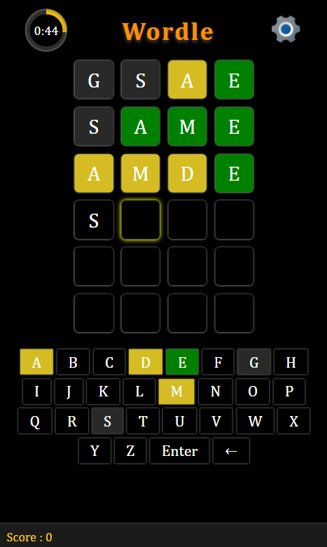

# **WORDLE** 

---

 

## **Description 📃**
- Guess the word

## **functionalities 🎮**
- 6 guesses given to the user
- Color coding for right, wrong and close guesses
- Keyboard key's color also change accordingly.
- User can choose word size 3, 4, or 5 letter words
- Score is also stored

 

## **How to play? 🕹️**
- A word is randomly selected by the computer.
- Player tries to guess this word.
- When a guess is made. Tiles change its color accordingly.
  Correct letter with correct position - GREEN
  Correct letter with wrong position - YELLOW
  Wrong letter - Grey
- The keyboard keys also change color based on above color coding scheme.
- User has to guess the word within a minute.  

 

## **Screenshots 📸**

 

 

## **Working video 📹**
<!-- add your working video over here -->
