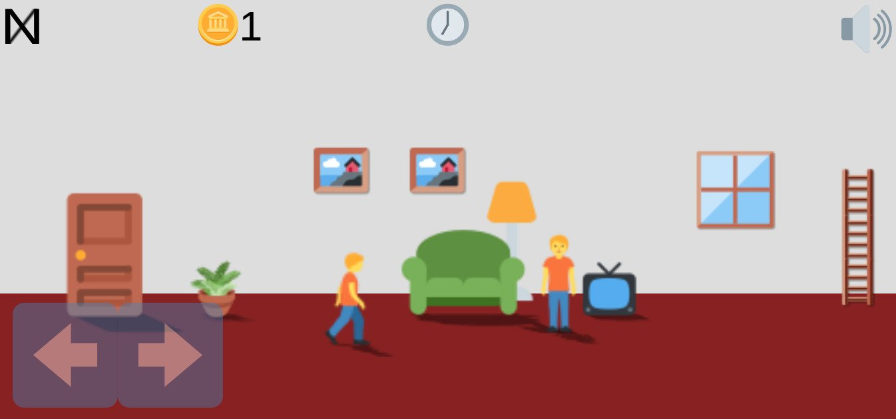

# **World_Of_Emojis** 

---

 

## **Description 📃**
- This game is a life simulator where you live your life in a world of emojis. You start out as a default emoji, but you can earn new emojis by completing challenges and tasks.

- The game is played in a series of levels, each of which has a different goal. For example, in one level, you might need to find a job, while in another level, you might need to build a house.

- To complete a level, you will need to interact with other emojis and objects in the world. For example, you might need to talk to a friend to get a job, or you might need to collect wood to build a house.

- As you progress through the game, you will earn new emojis and items that will help you complete the challenges. You will also unlock new areas of the world to explore.

- The goal of the game is to live a happy and fulfilling life. You can do this by completing challenges, earning new emojis, and exploring the world.

## **How to play? 🕹️**

- Talk to other emojis. Talking to other emojis is a great way to learn about the world and find new opportunities.
- Complete challenges. Completing challenges will earn you new emojis and items that will help you progress through the game.
- Explore the world. There are many different areas to explore in Emoji Life. Each area has its own unique challenges and rewards.
- Have fun! Emoji Life is a fun and challenging game. The most important thing is to have fun and enjoy the experience.

 

## **Screenshots 📸**

 

 
