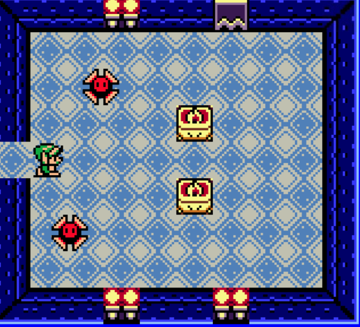

# **Game_Name** 

Mario Game

 

## **Description 📃**
<!-- add your game description here  -->
- The gameplay mechanics of Mario games often involve running, jumping, and occasionally performing special moves like wall jumps or ground pounds. Mario can also interact with the environment by breaking bricks, hitting question blocks, and riding on platforms or vehicles. The levels are designed with precision, offering a mix of platforming challenges, hidden secrets, and boss encounters.

## **functionalities 🎮**
<!-- add functionalities over here -->
- Game Initialization: The code initializes the game using the Kaboom.js framework and sets up the game window with specified settings, such as global properties, fullscreen mode, scale, debug mode, and clear color.

- Sprite Loading: The code loads various sprites for different game objects, including the player character, walls, doors, enemies, items, and background.

- Level Setup: The code defines the layout of game levels using a grid-based system. It specifies the arrangement of walls, doors, enemies, and other objects using characters representing different sprites.

- Player Control: The player can control the character's movement using arrow keys (left, right, up, down). The character's sprite changes based on the movement direction.

- Collision Detection: The code handles collision detection between game objects. It detects collisions between the player and doors, the player and dangerous entities (slicers and skeletors), and kabooms and skeletors.

- Score Tracking: The code keeps track of the player's score using a score label. The score increases when a kaboom collides with a skeletor.

- Game Scene Transition: When the player reaches a door, the game transitions to the next level by reloading the "game" scene with an incremented level index. When the player collides with a dangerous entity, the game transitions to the "lose" scene, displaying the player's score.

- Game Over: The "lose" scene simply displays the player's score at the center of the screen.

- Entity Movement: The code defines the movement behavior of slicers and skeletors. They move horizontally (slicers) or vertically (skeletors) and change direction upon colliding with walls.

- Effects: The code includes some visual effects, such as camera shaking when a kaboom collides with a skeletor.
 

## **How to play? 🕹️**
<!-- add the steps how to play games -->
- Run the game code using an appropriate environment or platform that supports the Kaboom.js framework.

- Once the game starts, you will control a character represented by a sprite of Link from The Legend of Zelda series.

- The objective of the game is to navigate through the maze-like levels, avoid dangerous entities, and collect points.

- Use the following controls to move the player character:

Arrow key "left" to move left.
Arrow key "right" to move right.
Arrow key "up" to move up.
Arrow key "down" to move down.
As you move, the character's sprite will change accordingly based on the movement direction.

- The player character can drop a "kaboom" by pressing the spacebar. The kaboom will appear in the direction the player is facing.

- Avoid coming into contact with the dangerous entities called slicers and skeletors. Colliding with them will result in losing the game.

- The player character can pass through doors represented by "%" symbols.

- When the player character reaches a door marked with a "^" or "$" symbol, the game will transition to the next level, and a new maze layout will be presented.

- Collect points by colliding a kaboom with a skeletor. Each successful collision will increase your score.

- If the player character collides with a dangerous entity or loses the game, the "lose" scene will be displayed, showing the player's score.

- You can restart the game by running it again or resetting the game state.

- Enjoy playing and try to achieve the highest score possible by navigating through the levels and collecting points!

 

## **Screenshots 📸**

 
<!-- add your screenshots like this -->

 

## **Working video 📹**
<!-- add your working video over here -->