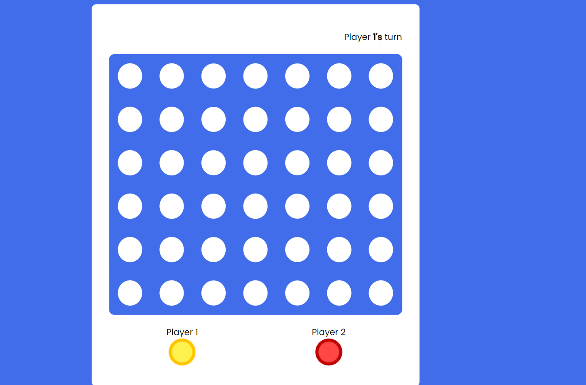

# **Connect4** 

---

 

## **Description 📃**
- This game is built using HTML, CSS and js .The connect four game can be compared to two players building a wall with a different colour of brick for each participant. The rule is straightforward: drop one brick at a time from each individual. A brick cannot stand alone in the air, just like an actual wall, so the player must place one brick on top of another. When one of the two players can arrange their bricks in a connect-four pattern, which consists of four bricks laid out horizontally, vertically, or diagonally, they have won the game.
- 

## ** Rules of the game**
- This is a two player( red and yellow) game.
- the game board is of size 6 * 7.
- A player wins if he/she is able to connect 4 dots horizontally, vertically or diagonally.
- The game ends when the board is completely filled and neither of the players win.

## **How to play the  the game**
- Press the "Start Game" button to start the game.
- In each turn , choose the column in which the brick has to be dropped.
- Each row will be filled from bottom to top in each column.

 

## **Screenshots 📸**

 

 

## **Working video 📹**
<!-- add your working video over here -->