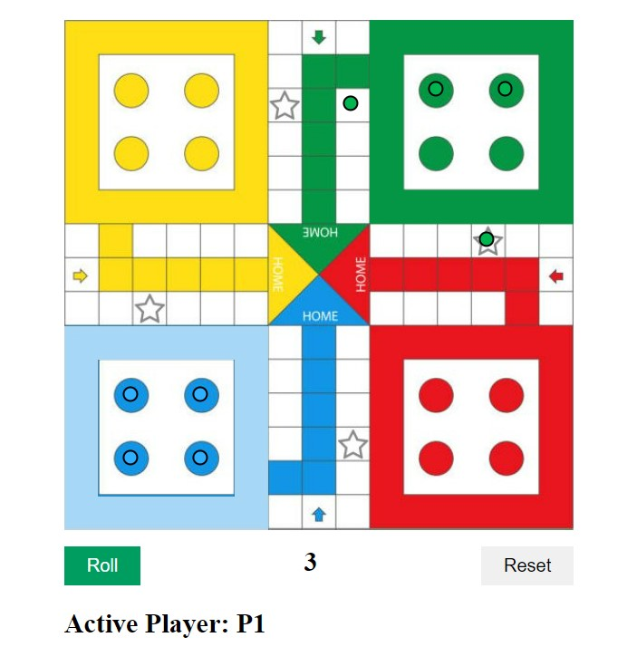

# **Game-Name** 

 # LUDO Game

 

## **Description 📃**
<!-- add your game description here  -->
- Ludo is a board game where players aim to move their tokens from the starting point to the center of the board. Rolling a dice determines the number of spaces a token can move. Capturing opponents' tokens and reaching the home area leads to victory. It's a mix of luck and strategy.

## **functionalities 🎮**
<!-- add functionalities over here -->
 two player game 
- 
* Game points
* Multiplayer board game.
* Simple rules.
* Colorful and visually appealing board design.
* Distinct tokens for each player.
* Dice rolling for movement.
 

## **How to play? 🕹️**
<!-- add the steps how to play games -->
-  roll the dice 

 

## **Screenshots 📸**

 
<!-- add your screenshots like this -->

 

 

## **Working video 📹**
<!-- add your working video over here -->
