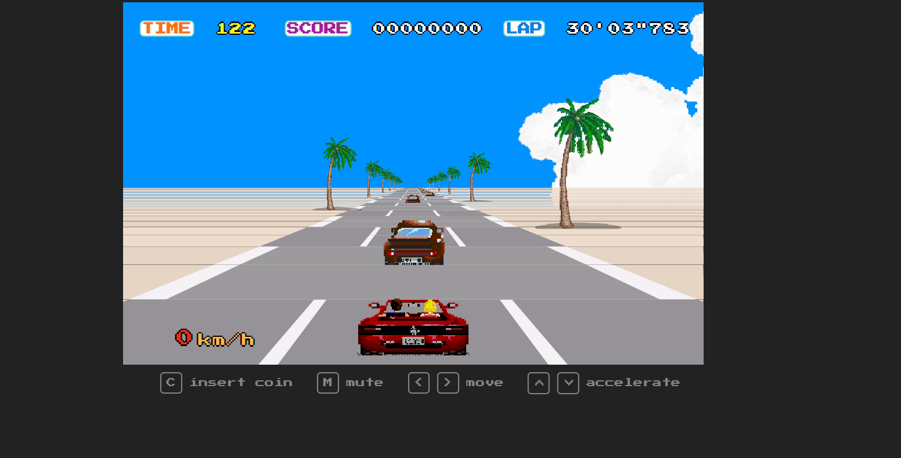

Description 📃

It is a 3D racing game using HTML, CSS, and JavaScript. It sets up event listeners for keyboard input, initializes game variables and objects, and updates the game state in a loop. The game involves driving a car on a road,avoiding obstacles and other cars, and trying to complete laps as quickly as possible. The code also includes functionality for displaying a high score table and playing sound effects.

The code sets the background color, font family, and height of the body. It also defines the styles for the top UI elements such as the time, score, and lap counters. Additionally, it sets the styles for the tachometer at the bottom of the screen.

It has all the styles for a game interface, including the positioning and appearance of various elements such as the road, hero character, clouds, and high score display. It also includes animations for blinking text and transitions for opacity and timing.

functionalities 🎮
It is basically a normal race game where we see a screen in front of us and instructions below the screen  describing about how to play the game.It has all the sounds which a race game should have. The race begins on a track where there are multiple cars and we have to race against them. When we come infront of any other car our car's speed becomes zero and the car honks. 

How to play? 🕹️

To begin we have to press 'c' and to accelerate the car we have to press 'up' arrow and to deaccelerate the car we have to press 'down' arrow. To move aside we have to press 'right' arrow and and 'left' arrow respectively to move right and left. To mute the sounds we have to press 'm'.

Screenshot:

