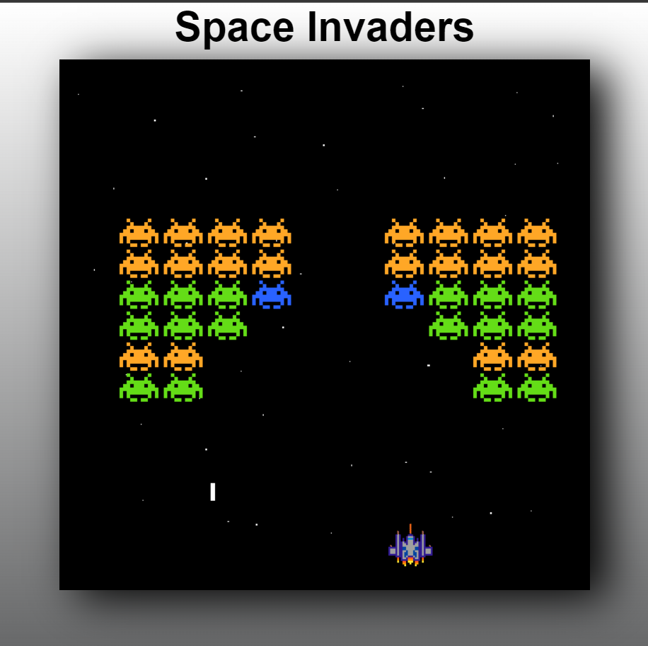

# **space_invaders** 

---

 

## **Description 📃**
- In Space Invaders, the player controls a small spaceship that moves horizontally at the bottom of the screen. The objective is to shoot and destroy waves of descending alien invaders while avoiding their projectiles and barriers. The aliens move left and right, gradually descending towards the player's spaceship. If the aliens reach the bottom of the screen or the player's spaceship is hit by an enemy projectile, the game ends.

## **How to play? 🕹️**
- click space bar for shooting
- move spaceship left and right with <- & -> keys
	
 

## **Screenshots 📸**

 

 